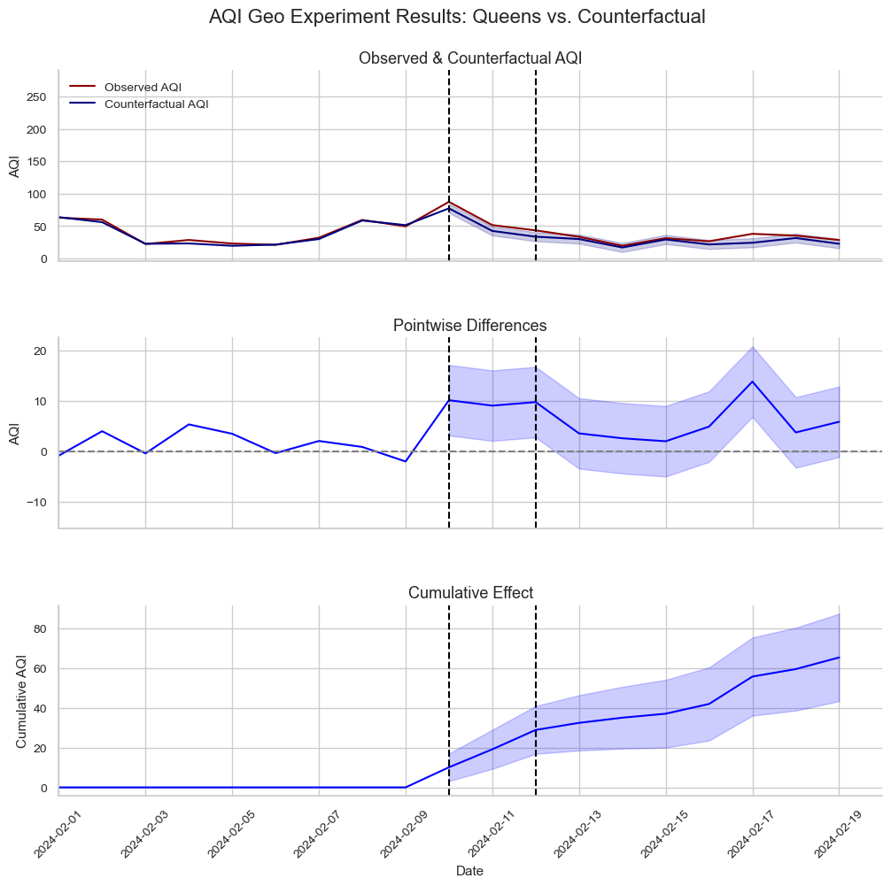

# Air Quality Geo Experiments

This project explores whether worsening air quality causally increases emergency department visits for respiratory issues, using a geo experiment framework inspired by marketing attribution methods. By analyzing AQI and health data from the Bronx and Queens, and applying Google's Time-Based Regression (TBR) methodology, I attempt to quantify the causal effect of AQI spikes on health outcomes. While the model shows a positive point estimate for additional ED visits per 1-point AQI increase, it is not statistically significant. Going forward, improvements to the model might be made by addressing limitations present in health outcome data.

## Blog Post

Read the full write-up [here](https://iherman10.github.io/projects/air_quality_geo_experiments/).
